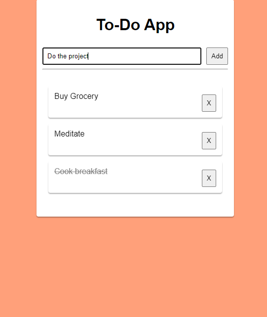

# 📝 Simple Task Manager (Plain PHP + HTML + GraphQL)

A minimal **Task Manager** application using **GraphQL** in plain PHP with a simple HTML frontend.  
This project demonstrates how to integrate GraphQL queries and mutations without using a framework.

---

## 📌 Features
- View tasks (GraphQL Query)
- Add new tasks (GraphQL Mutation)
- Simple HTML frontend for interaction
- Backend powered by plain PHP

---

## ⚙️ Requirements
- PHP 7.4+ (with `json` extension enabled)
- Web server (Laragon/Xampp)

---

## 🚀 Installation
1. Clone this repository:
   ```bash
   git clone https://github.com/HarveyDangel/todo_app.git
   cd todo_app

2. Start Apache and MySQL server using Laragon/Xampp

3. Create a new database:
   ```sql
    CREATE DATABASE todo_app;
    USE todo_app;

    CREATE TABLE tasks (
    id INT AUTO_INCREMENT PRIMARY KEY,
    title VARCHAR(255) NOT NULL,
    done BOOLEAN DEFAULT FALSE
    );
   
3. Open your browser:
   ```bash
   http://localhost:8000/todo_app/index.html

   or

   http:todo_app.test
   
---

## Screenshot
   

## 📄 License
MIT License.
Feel free to modify and use for learning purposes.

